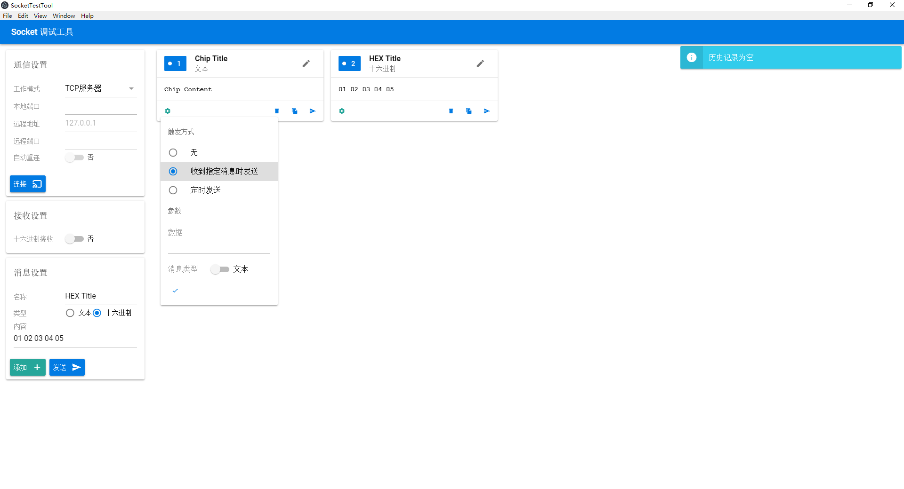

# Socket Test Tool

> Powered by [Quasar Framework][quasar].

This is a tool for socket testing. 

## Features

- [x] Support create socket in TCP Server mode.
- [x] Send socket message in text and hex mode.
- [x] Save or delete usually use socket messages (called Chips for short) as cards to resend them.
- [x] Set triggers for each Chip. Sending can be triggered by a interval timmer or certain receive message.

## Screen Shoots

## Future Works

- [ ] Support TCP server, TCP client, UDP. ***(TCP Server support only now.)***
- [ ] Show communication history in a chat mode.
- [ ] Edit Chips and copy to clipboard.
- [ ] Inport and export all Chips.
- [ ] Field validation.
- [ ] Sort Chips by user-defined order.
- [ ] Group Chips.
- [ ] Support Chinese, English and other languages.

[quasar]:http://www.quasarchs.com/